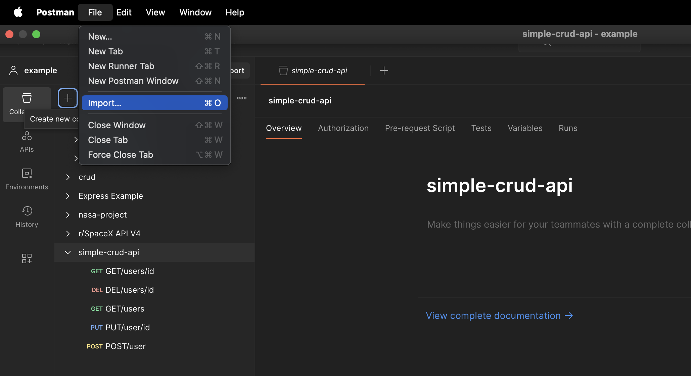
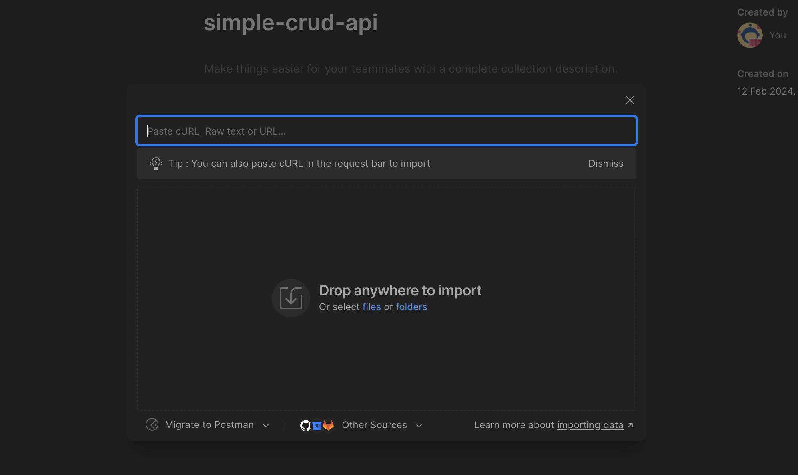
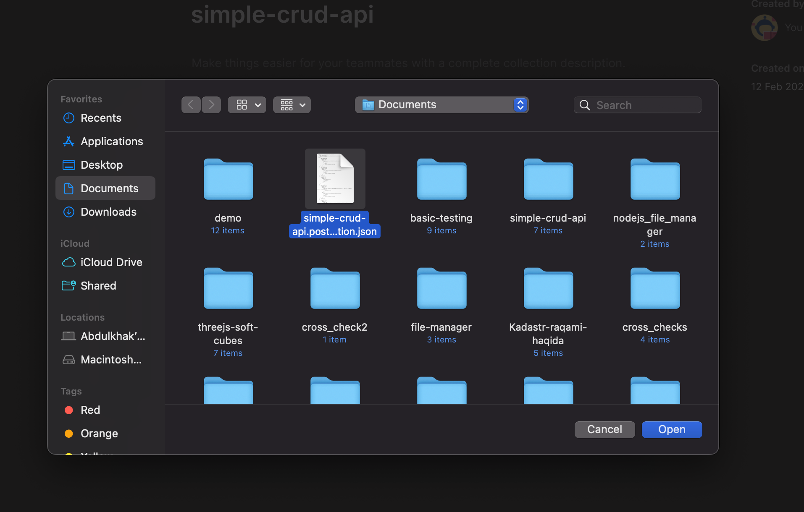
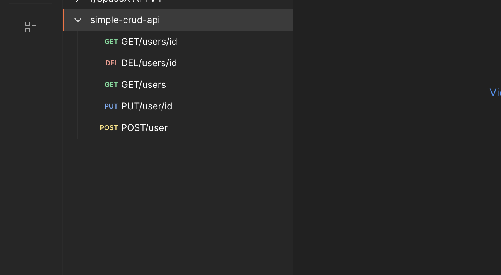

### Simple CRUD API


First clone the repo with this command:

```bash
$ git clone https://github.com/AbdulxaqDev/simple-crud-api.git
```


To run the application, firs you need to install dependencies. So to install them run the folowing command in terminal:

```bash
$ npm run install
```

After installing dependencies, you can run the application. So, you can run the application in different modes, development and production mode.
In development mode the application runs from directly typescript source code. In production mode, first the bundle of application is build by webpack and run that baundle.

Decelopment command:

```bash
$ npm run start:dev
```

Prosuction command:

```bash
$ npm run start:prod
```

The application also includes endpoint tests. They check the following functionality of endpoints:

- Get all users
- Get a user with an invalid ID
- Get a user with an nonexisting ID
- Post a new user
- Delete a specific user with ID
- Update a specific user with ID
  (in total 6 tests)

So to run the test use the following command in terminal:

```bash
$ npm run test
```

Highly recommend the [Postman](https://www.postman.com/downloads/) to test the application.

In this repo, I added (in postman_collection folder) the ready Postman API collection, you can easely import it to your Postman and start testing the application easily and more faster.

After cloning the this repository, import the collection file with Postman:



after clicking to the import following window appears



then click to files, it wll opeb file explorar:



Then the postman will be ready for the test.




